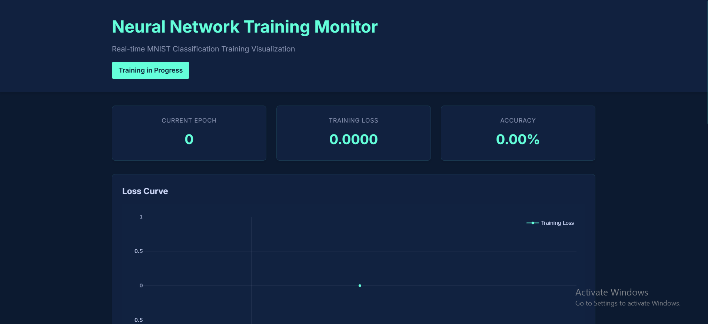
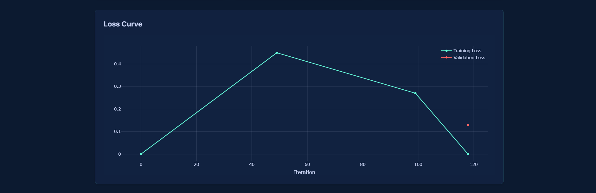

# MNIST Training Monitor

A real-time visualization tool for monitoring MNIST digit classification training using a CNN implemented in PyTorch with Flask-based web interface.

## Features

- Real-time training metrics visualization
- Live training log updates
- Interactive plots for loss and accuracy
- Final results visualization with sample predictions
- Responsive web interface

## Requirements

- Python 3.8+
- PyTorch
- Flask
- Matplotlib
- NumPy
- Requests
- tqdm
- Plotly.js (included via CDN)
- jQuery (included via CDN)

## Portal UI


## Installation & Setup

1. Clone the repository: 
```bash
git clone [repository-url]
cd mnist-training-monitor
```

2. Create and activate a virtual environment (recommended):
```bash
# On Windows
python -m venv venv
.\venv\Scripts\activate

# On macOS/Linux
python3 -m venv venv
source venv/bin/activate
```

3. Install dependencies using requirements.txt:
```bash
pip install -r requirements.txt
```

4. Create required directories:
```bash
mkdir -p static templates data
```

5. Verify installation:
```bash
python -c "import torch; print(f'PyTorch version: {torch.__version__}')"
python -c "import flask; print(f'Flask version: {flask.__version__}')"
```

5. Copy the project files to their respective directories:
- `server.py` → root directory
- `train.py` → root directory
- `index.html` → templates/
- `style.css` → static/

## Running the Application

1. Start the Flask server:
```bash
python server.py
```

2. Open a new terminal window, activate the virtual environment, and start the training:
```bash
python train.py
```

3. Open your web browser and navigate to:
```
http://localhost:5000
```

## Project Structure

```
mnist-training-monitor/
├── server.py           # Flask server implementation
├── train.py           # CNN model and training logic
├── templates/
│   └── index.html    # Web interface template
├── static/
│   └── style.css     # CSS styling
├── data/             # MNIST dataset storage
└── README.md
```

## Model Architecture

The CNN model consists of:
- 4 convolutional layers with batch normalization
- MaxPooling layers for dimensionality reduction
- Dropout layers (0.5) for regularization
- 2 fully connected layers
- ReLU activation functions

## Monitoring Features

The web interface provides:
- Real-time loss and accuracy plots
- Current epoch, loss, and accuracy metrics
- Live training log
- Sample predictions visualization
- Responsive design for all screen sizes

## Troubleshooting

1. If the server fails to start:
   - Check if port 5000 is available
   - Ensure all required packages are installed
   - Verify file permissions in the project directories

2. If training doesn't start:
   - Confirm CUDA availability for GPU training
   - Check system memory availability
   - Verify MNIST dataset download permissions

3. If visualization doesn't update:
   - Clear browser cache
   - Check browser console for errors
   - Verify network connectivity to localhost

## Contributing

1. Fork the repository
2. Create a feature branch
3. Commit your changes
4. Push to the branch
5. Create a Pull Request

## License

[Add your license here]

## Acknowledgments

- MNIST Dataset providers
- PyTorch development team
- Flask framework contributors

## Version Requirements

- Python >= 3.8
- CUDA >= 11.0 (for GPU support)
- All other dependencies are listed in requirements.txt

## Updating Dependencies

To update to the latest compatible versions:
```bash
pip install --upgrade -r requirements.txt
```

## Development Installation

For development, you might want to install additional packages:
```bash
pip install -r requirements.txt
pip install pytest black flake8 mypy  # Development tools
```