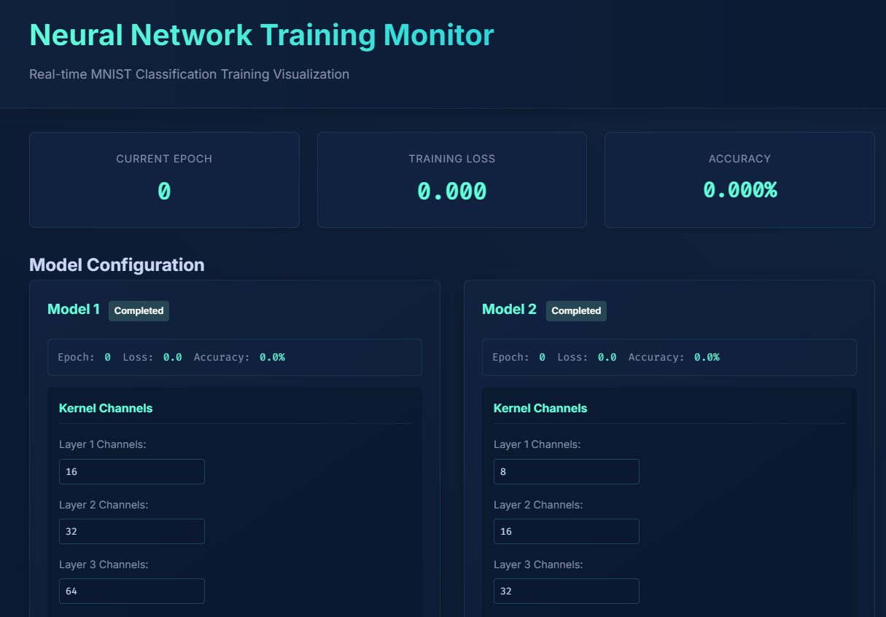
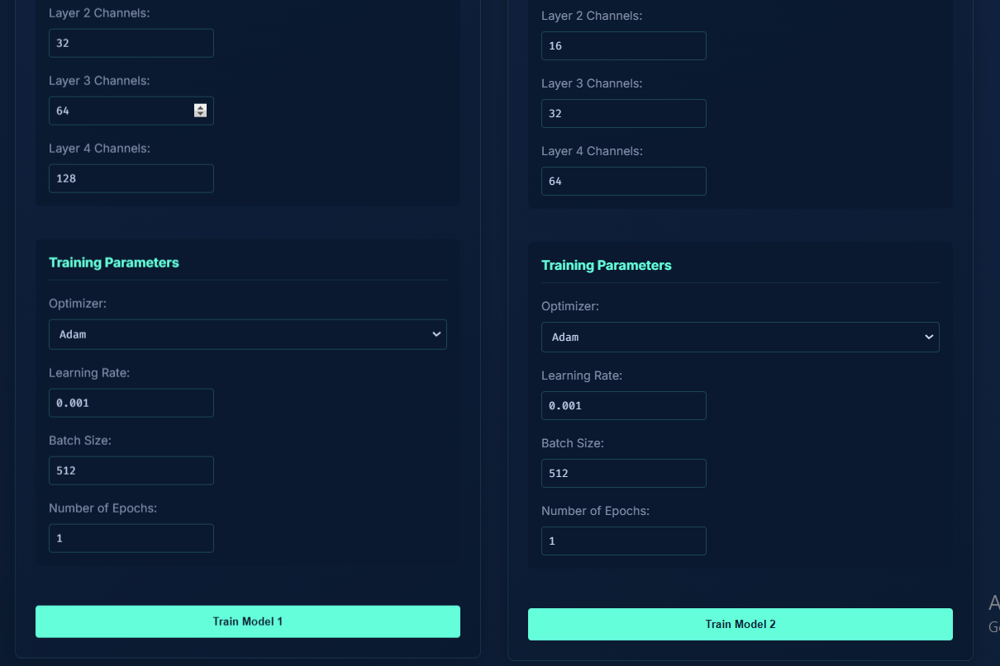

# Neural Network Training Monitor

A real-time visualization tool for training and comparing MNIST classification models with different architectures and hyperparameters.

## Demo Video

[Demo](https://github.com/techpvk/ERA-V3/blob/main/s4/static/demo.mp4)

## Features

- Real-time training visualization
- Concurrent model comparison
- Customizable network architecture
- Multiple optimizer support (Adam, SGD, RMSprop, Adagrad)
- Live metrics tracking
- Interactive plots
- Training logs
- Modern UI with AI theme

## Screenshots

### Real-time Training Interface


### Model Comparison


### Live Metrics


## Requirements

- Python 3.8+
- PyTorch
- Flask
- CUDA-capable GPU (optional, but recommended)

## Installation

1. Clone the repository:
```bash
git clone [repository-url]
cd neural-network-monitor
```

2. Create and activate a virtual environment (recommended):
```bash
# On Windows
python -m venv venv
.\venv\Scripts\activate

# On macOS/Linux
python3 -m venv venv
source venv/bin/activate
```

3. Install dependencies:
```bash
pip install -r requirements.txt
```

4. Download UI assets:
```bash
python download_assets.py
```

## Usage

1. Start the server:
```bash
python server.py
```

2. Open your browser and navigate to:
```
http://localhost:5000
```

3. Configure and train models:
   - Set network architecture (channels per layer)
   - Choose optimizer (Adam, SGD, RMSprop, Adagrad)
   - Set learning rate
   - Adjust batch size and epochs
   - Click "Train Model" to start training

## Model Configuration Options

### Network Architecture
- Layer 1-4 channels: 1-512
- Batch size: 32-1024
- Epochs: 1-100

### Optimizers
- Adam (default)
  - Learning rate: 0.001
  - Beta1: 0.9
  - Beta2: 0.999
- SGD with momentum
  - Learning rate: 0.01
  - Momentum: 0.9
- RMSprop
  - Learning rate: 0.001
  - Alpha: 0.99
- Adagrad
  - Learning rate: 0.01
  - Initial accumulator: 0

## Project Structure

```
neural-network-monitor/
├── server.py           # Flask server and training coordinator
├── train.py           # Neural network model and training logic
├── static/            # Static assets and styles
│   ├── style.css     # CSS styling
│   ├── demo.mp4      # Demo video
│   └── screenshots/  # UI screenshots
├── templates/         # HTML templates
│   └── index.html    # Web interface
├── data/             # Dataset storage
└── README.md
```

## Features in Detail

### Real-time Monitoring
- Loss tracking
- Accuracy metrics
- Training progress
- Validation results

### Comparison Tools
- Side-by-side model comparison
- Performance plots
- Architecture comparison

### Interactive UI
- Live updates
- Dynamic plots
- Training logs
- Status indicators

## Contributing

1. Fork the repository
2. Create your feature branch
3. Commit your changes
4. Push to the branch
5. Create a Pull Request

## License

This project is licensed under the MIT License - see the LICENSE file for details.
